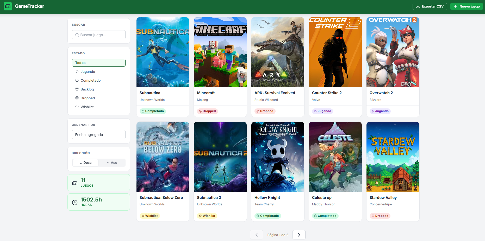
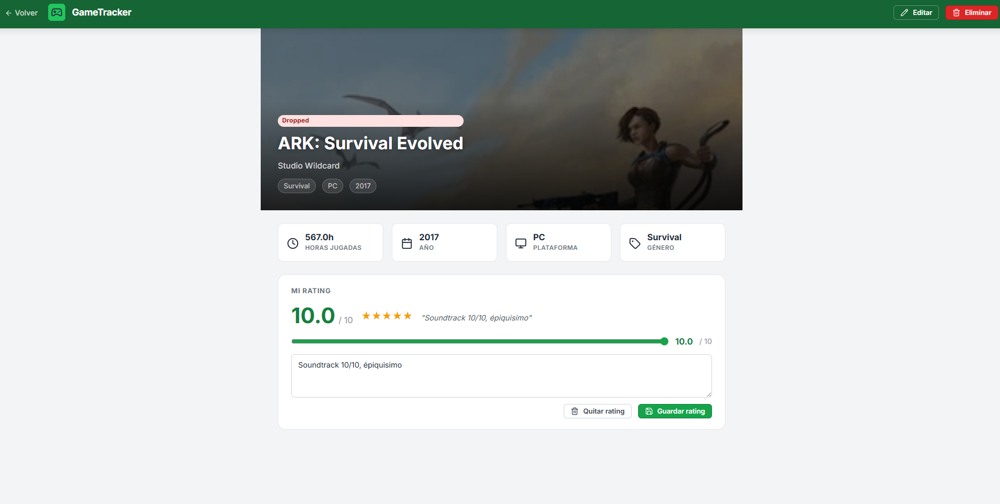
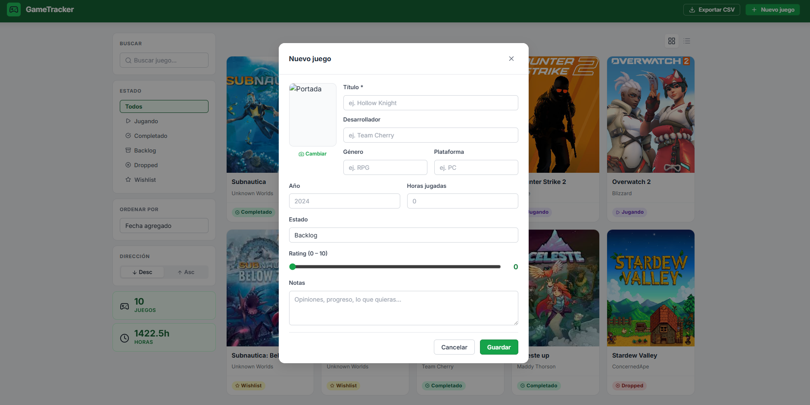

# GameTracker — Frontend

A personal game library tracker built with vanilla HTML, CSS, and JavaScript. Track your games by status, rate them, log hours played, and export your list to CSV.

## Screenshots

| | |
|---|---|
|  |
|  |  |

---

## Live Demo

| Resource | URL |
|---|---|
| Frontend (Vercel) | https://gametracker-client.vercel.app |
| Backend API (Vercel) | https://gametracker-api.vercel.app/health |

## Backend Repository

> https://github.com/JonathanTubac/gametracker-api.git

---

## Completed Challenges

| Challenge | Points |
|---|---|
| Export game list to CSV — generated manually from JavaScript, no libraries. File downloads from the browser. | 20 |
| Rating system — REST endpoints (`POST /games/:id/rating`, `GET /games/:id/rating`, `DELETE /games/:id/rating`), visible in the client with star display and review text. | 30 |
| Image upload support via Cloudinary (max ~1 MB per image). | 30 |

---

## Features

- Add, edit, and delete games from your library
- Filter by status: Playing, Completed, Backlog, Dropped, Wishlist
- Sort by title, release year, hours played, or date added
- 0–10 rating system
- Game cover upload via Cloudinary
- CSV export
- Grid and list views
- Pagination (10 results per page)

## Tech Stack

- Vanilla HTML / CSS / JavaScript (ES Modules)
- nginx (static file server)
- Docker + Docker Compose
- Cloudinary (image hosting)

---

## Running with Docker

### Prerequisites

- [Docker](https://docs.docker.com/get-docker/) installed and running

### Option 1 — Docker Compose (recommended)

Copy the example compose file and start the container:

**Linux / macOS (bash)**
```bash
cp docker-compose.yml.example docker-compose.yml
docker compose up -d
```

**PowerShell**
```powershell
Copy-Item docker-compose.yml.example docker-compose.yml
docker compose up -d
```

**CMD**
```cmd
copy docker-compose.yml.example docker-compose.yml
docker compose up -d
```

The app will be available at **http://localhost:8080**.

To stop:
```bash
docker compose down
```

---

### Option 2 — Docker CLI (no Compose)

**Linux / macOS (bash)**
```bash
# Build the image
docker build -t gametracker-front .

# Run the container
docker run -d \
  --name gametracker-front \
  -p 8080:80 \
  --restart unless-stopped \
  gametracker-front
```

**PowerShell**
```powershell
# Build the image
docker build -t gametracker-front .

# Run the container
docker run -d `
  --name gametracker-front `
  -p 8080:80 `
  --restart unless-stopped `
  gametracker-front
```

**CMD**
```cmd
REM Build the image
docker build -t gametracker-front .

REM Run the container
docker run -d ^
  --name gametracker-front ^
  -p 8080:80 ^
  --restart unless-stopped ^
  gametracker-front
```

The app will be available at **http://localhost:8080**.

---

### Useful Docker commands

| Action | Command |
|---|---|
| View running containers | `docker ps` |
| View logs | `docker logs gametracker-front` |
| Stop the container | `docker stop gametracker-front` |
| Remove the container | `docker rm gametracker-front` |
| Rebuild after changes | `docker compose up -d --build` |

---

## Tech Reflection

### Would we use this stack again?

**Vanilla JS — yes, with caveats.** Keeping the frontend dependency-free made the project fast to start and easy to deploy anywhere. There was no build step, no bundler config to fight, and the Docker image stayed tiny. The real friction showed up around state management: as features grew (filters, sorting, pagination, modals all living on the same page), keeping the UI in sync with application state became increasingly manual. A lightweight library like Alpine.js or even a simple reactive store would have saved a lot of repetitive DOM queries without adding meaningful complexity.

**nginx for static files — yes, no reservations.** It did exactly what it needed to and required almost no configuration. Serving ES modules with correct MIME types just worked.

**Cloudinary — yes.** The free tier covered the project's needs, and offloading image storage and transformation to a CDN meant zero server-side file handling. The main catch was the ~1 MB upload limit imposed by Vercel's function payload cap on the backend side, not Cloudinary itself.

**Docker — yes.** Wrapping nginx in a container made local development and deployment identical, which eliminated a whole class of "works on my machine" issues. The compose setup made it trivial to share a reproducible environment.

**Biggest challenge:** coordinating UI state across multiple async operations (loading a game list, applying a filter, and uploading an image can all race each other) without a reactive framework required careful sequencing and more defensive rendering code than anticipated. If the project were to grow significantly, this would be the first thing to revisit.

---

## API Configuration

The frontend auto-detects the environment via `js/config.js`:

| Environment | API URL |
|---|---|
| `localhost` | `http://localhost:3000/api/v1` |
| Any other host | `https://gametracker-api.vercel.app/api/v1` |

To point to a different backend, edit `js/config.js` before building the Docker image.

---

## Project Structure

```
gametracker-front/
├── css/
│   ├── components.css
│   ├── layout.css
│   └── main.css
├── js/
│   ├── api.js        # All fetch calls to the backend
│   ├── config.js     # API URL config
│   ├── main.js       # Entry point
│   ├── render.js     # DOM rendering helpers
│   └── detail.js     # Game detail page logic
├── pages/
│   └── detail.html
├── index.html
├── nginx.conf
├── Dockerfile
└── docker-compose.yml.example
```
